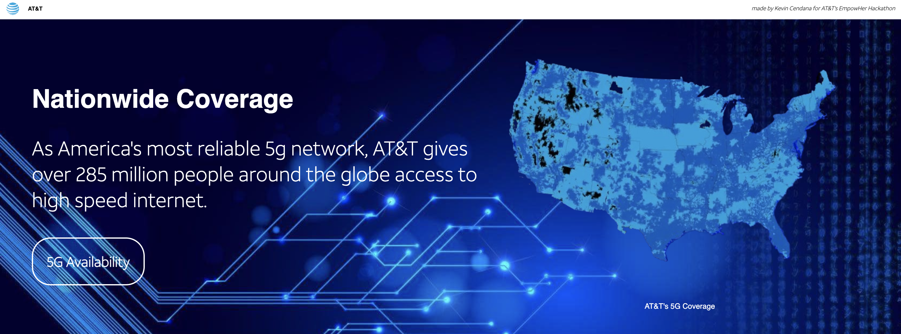
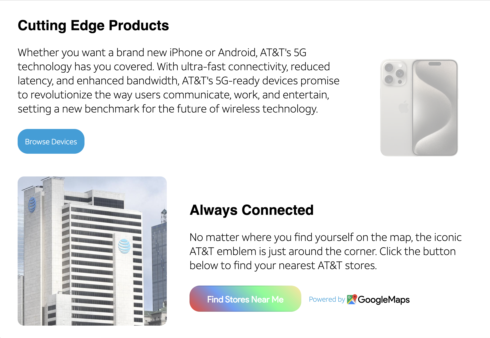

# AT&T Hackathon: [EmpowHer](https://inside.att.jobs/empowherhackathon#subpage/welcome)

### **Deployment: [Check out the website!](https://attempowherhackathon.netlify.app/)**
I deployed the website using Netlify, a popular platform for deploying web projects!

  
  
  
  

### Overview:

During this hackathon, I developed a dynamic and interactive website for AT&T, focusing on their 5G services. The website was crafted using a combination of **HTML, CSS, and JavaScript**, and was deployed using **Netlify.**
I had a bit of experience with HTML & CSS before but JS was pretty new to me, and I've never integrated an API with a website before. Overall, it was surprisingly fun experience, and I'm excited to join similar hackathons!

### Key Features:
- **Design:** I tried to make the website as aesthetically pleasing as possible, making use of high-quality images and text to highlight the benefits and features of AT&T's 5G services.
Images were made using MidJourney's AI generated artwork by blending provided AT&T images together, and official fonts and colors were used from AT&T, Google, and NewsAPI.
I added several CSS special effects such as zoom-in effects on hover, fade-in animations, slide-in animations, a slideshow, and more. 

- **Google Maps API Integration**: I incorporated the Google Maps API to allow users to find AT&T stores near their them.
Users can click on the "Find Stores Near Me" button, which prompts a custom confirmation popup. Upon confirmation, the user's location is fetched, and nearby AT&T stores are displayed on the map.

- **News API Integration:** The also website fetches and displays the latest 5G news articles using NewsAPI.
News articles are presented in a grid format, with each article displayed as a card containing an image, title, description, and a link to read more.
- **Responsiveness:** I scaled the website in a way that users from different devices would still find it to be responsive.
- **Security:** I added a layer of security by masking over the API keys just in case, even though they are already restricted to only be used on my website. The keys are retrieved from Netifly, and the GoogleMaps API Key is injected when run.
